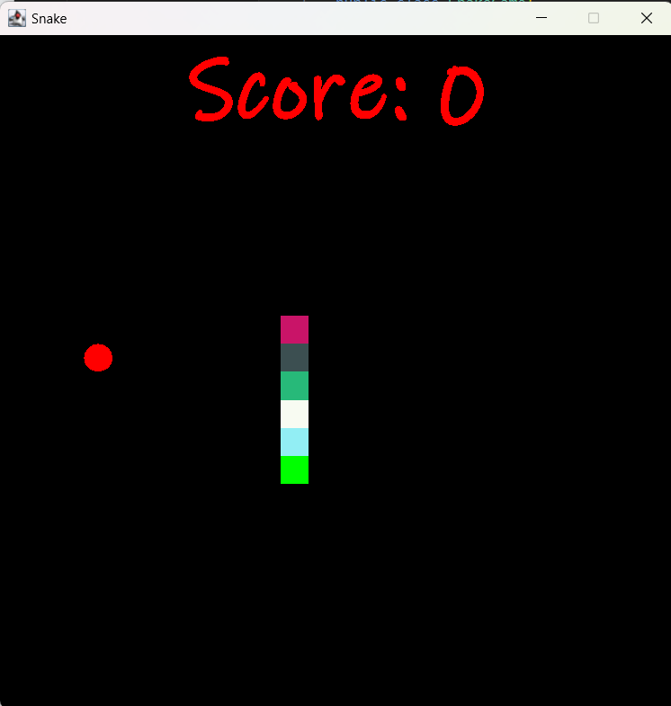

# SnakeGame

## Overview
This is a simple Snake Game developed using Java. The goal of the game is to control the snake to eat food, growing in length as it eats, while avoiding collisions with the walls or the snake's own body. 

Feel free to download, modify, or use it as a base for your own projects!

## Technologies Used
- **Java**: For all backend components.
- **JFrame Package**: For helping with the UI design.

## Features
- Real-time snake movement with arrow keys.
- Score tracking.
- Game-over conditions (collision with the walls or snake body).
- Responsive game layout.

## Getting Started
1. Clone the repository:
2. Navigate to the project directory:
    ```bash
    cd SnakeGame
    ```
3. Recompile (if needed)
4. Run `java SnakeGame` in your terminal to run the game.

## How to Play
- Use the arrow keys to control the snake (Up, Down, Left, Right).
- Eat the food to grow longer.
- Avoid hitting the walls or the snake's own body, or the game will be over.

## Screenshots


## Author
- **James Danforth** - Junior at Lehigh University studying Computer Science and Business.
- Passionate about game development and improving problem-solving skills through fun projects like this one.

## Contact
Feel free to reach out if you have any questions or suggestions:
- Email: [jad626@lehigh.edu](mailto:jad626@lehigh.edu)
- GitHub: [https://github.com/James-Danforth](https://github.com/James-Danforth)
